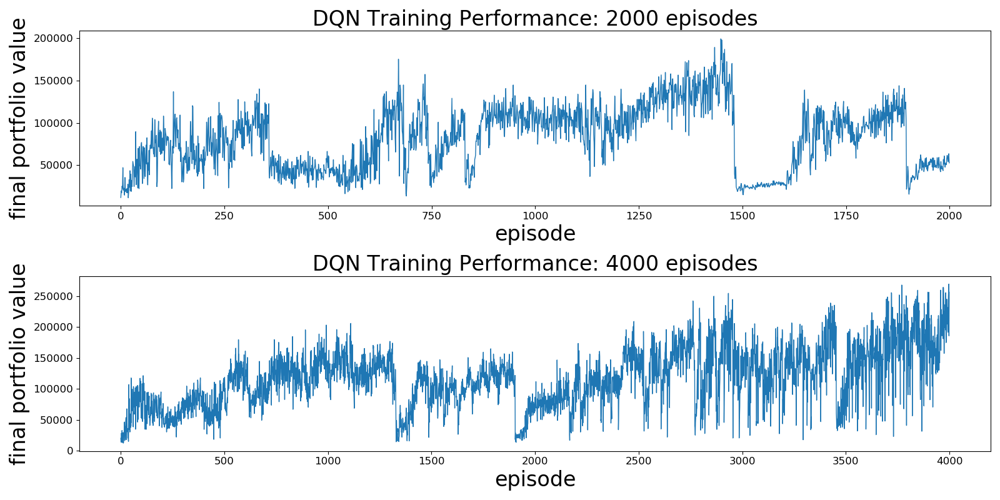
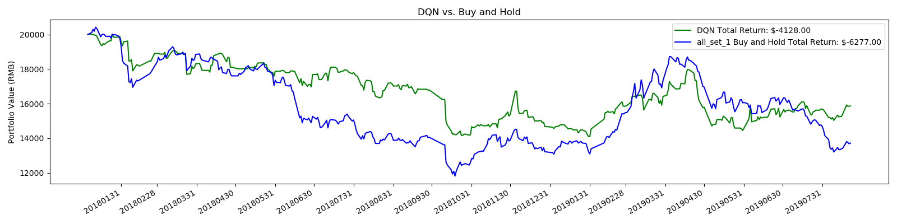
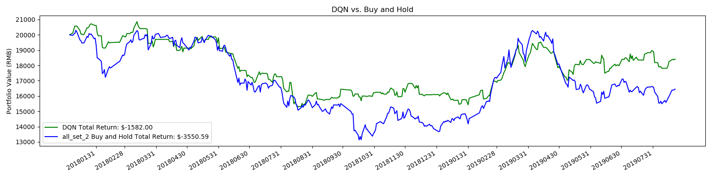

# Introduction

This repo is part of CS277 project: [Deep Reinforcement Learning in Portfolio Management](https://wjie12.github.io/2020/01/19/RL4PM/)

The whole project consists three repos for three parts:
1. [Preprocessing](https://github.com/WJie12/autotrading_preprocessing):
    * Pre-stock-selection
    * Processing raw data provided by SSE
    * Generating datasets for DQN and DDPG based on the selected stocks
2. [DQN](https://github.com/WJie12/autotrading_DQN):
    * Implement of trading agent based on DQN
3. [DDPG](https://github.com/morningsky/CS277-Project-DRL-in-Portfolio-Management):
    * Implement of trading agent based on DDPG

This repo is for the DQN part.

# How to run

## Dependencies

Python 3.6

`pip install -r requirements.txt`

## Run

**To train a Deep Q agent**, run `python run.py --mode train`. There are other parameters and I encourage you look at the `run.py` script. After training, a trained model as well as the portfolio value history at episode end would be saved to disk.

**To test the model performance**, run `python run.py --mode test --weights <trained_model>`, where `<trained_model>` points to the local model weights file. Test data portfolio value history at episode end would be saved to disk.

abbreviation|para|default|usage
---|---|---|---
-e | --episode| default=2000 |number of episode to run
-b |--batch_size| default=32 |batch size for experience replay
-i |--initial_invest |default=20000 | initial investment amount
-m |--mode'| required=True |either "train" or "test"
-w |--weights| required when mode = "test" | a trained model weights

Example:
* train: `python run.py --mode train`
* test: `python test.py --mode test --weights ./weights/201912141307-dqn.h5 -e 500`

## Structure
```python
|-data
|-portfolio_val
|-visualization
|-weights
|-requirements.txt
|-agent.py
|-envs.py
|-model.py
|-run.py
|-utils.py
```
* `/data`: the csv files of stock table and history close price of 19 stocks. The files are generated on preprocessing part.
* `/weights`: the files stored weights trained by DQN
* `/visualization`: figures of visualization
* `/portfolio_val`: the portfolio values during episodes when trading or testing
* `agent.py`: a Deep Q learning agent
* `envs.py`: a simple 3-stock trading environment
* `model.py`: a multi-layer perceptron as the function approximator
* `utils.py`: some utility functions
* `run.py`: train/test logic
* `requirement.txt`: all dependencies


# Results

## Training on 19 stocks for 2000 episodes and 4000 episodes

dataset: all_set_1.csv, stock_table_1.csv

train：4000 episode

mean portfolio_val: 116988.378

median portfolio_val: 116565.0



## Testing on known old 19 stocks

dataset: all_set_1.csv, stock_table_1.csv

test: 500 episode

mean portfolio_val: 17703.272

median portfolio_val: 16994.000000000004



## Testing on unknown new 19 stocks

dataset: all_set_2.csv, stock_table_2.csv

test: 500 episode

mean portfolio_val: 15256.06

median portfolio_val: 15008.0



# Ref

The structure of code is mainly inspired by [ShuaiW](https://github.com/ShuaiW/teach-machine-to-trade).
